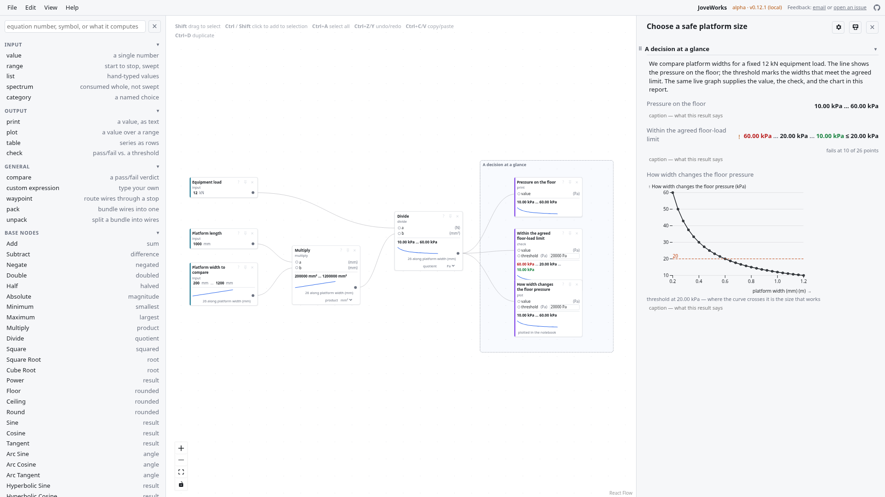

# JoveWorks

> Build engineering **NodeBooks**.

A node-editor design tool for dimensioning machine parts. Wire inputs,
equations and outputs together on a canvas; the graph *is* the calculation.



Built for a course on dimensioning of machine parts. Formulas follow
**Roloff & Matek, 6th edition**, and each one carries a citation back to its
textbook equation number.

```
pnpm install
pnpm dev         # the editor, at http://localhost:5173/
pnpm test        # vitest
pnpm build       # tsc -b; an undeclared cross-package import fails here
```

**New here? Start with [OVERVIEW.md](OVERVIEW.md)** — the whole project in one
read. Then [ROADMAP.md](ROADMAP.md) for what's still open.

## Why JoveWorks?

The name is a playful nod to Jupyter notebooks: Jove is another name for
Jupiter, and each visual calculation becomes a **NodeBook** — a notebook whose
calculation is built from connected nodes.

JoveWorks is a visual foundation for the Jupyter workflows engineers grow
into. It lets students build intuition for the physical relationships in a
machine-design model — seeing how formulas, units, assumptions and design
choices connect — before they need to build efficient coding workbooks.
Jupyter becomes the natural next step for custom methods, automation, richer
data or open-ended analysis. **Learn the model before you write the code.**

## What it is

- **Runs in the browser.** A static web app with no backend and nothing to
  install; students open a link.
- **Sweeps, not single answers.** Set any input to a range — linear, log, or a
  list of standard sizes — and the whole graph becomes a study, plotted against
  the acceptance threshold. This is the primary use, not an add-on.
- **The notebook comes back as a view.** Section frames on the canvas are the
  sections of a live report: prose, values, pass/fail checks and plots in
  reading order. Lighter group frames organise the canvas, can nest and
  collapse, but do not add report headings. That report is what gets handed
  in.
- **Formulas are data**, not code. The editor is both the product and the
  authoring tool for the formula catalogue.
- **Units are canonical internally** — mm, N, s, rad, K — converted at the
  boundary. An undeclared unit is a hard error.
- **Dimensions are port types.** A force output will not connect to a length
  input, and neither will a connection that would close a cycle.

## What it isn't

- **Not a computer algebra system, and not a solver.** Evaluation runs forwards
  over a directed acyclic graph. The kernel never rearranges a formula to solve
  for an unknown input, and it never iterates to hit a target value.

  *"I want this output — what inputs give me that?"* is a real question and it
  has three answers here, none of which is inversion:

  - the **rearranged formula**, where one exists. R&M numbers its own
    (`17.1A`/`B`/`C` are one relation in three arrangements), so solved-for
    versions are catalogue content, offered as *same equation, solved for…*;
  - a **sweep read against a threshold** — the curve crossing the acceptance
    line, which also shows the sensitivity around the answer that a single
    returned number hides;
  - a **design study**: check nodes over a swept grid, a feasibility map, and a
    decision card naming the constraint the design is actually up against.

  Inversion would answer worse, not just differently. Catalogue lookups, fit
  tables, categorical ports and applicability conditions make the preimage a
  set rather than a value; a real graph has more free inputs than targets, so a
  target picks out a region and not a point; and a root-finder converges
  happily to a design outside the formula's declared valid range. See
  [OVERVIEW.md](OVERVIEW.md) for the full reasoning, including the measurement
  that settled it.

## Licence

Engine and editor: **MIT.** This repository contains no textbook content.
Learning stays free — no paid tier is planned for the core tool.

The R&M formula catalogue: **restricted, not redistributable.** It lives in a
separate private repository and is delivered to students through the course LMS
— a repository boundary, not a build-time exclusion.
